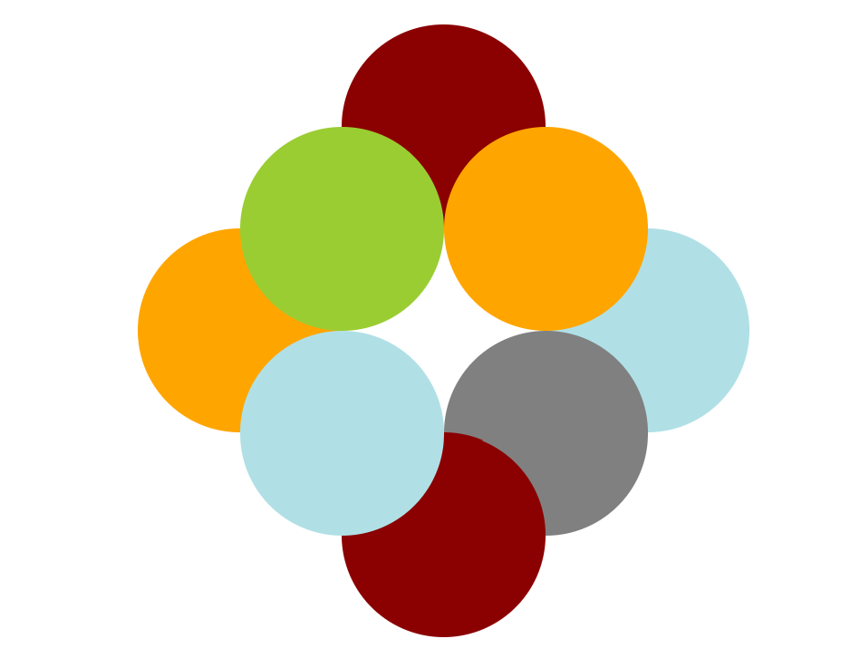

# Shapes Galore
This Shapes Galore exercise contains code setting up multiple circles of different colors that all overlap in different ways.

## How To Run
In order to run this code after cloning the repo, open shapes.html in a browser.

## Roadmap of Future Improvements
In the future, the hope is to improve on this project with the addition of button interaction and animation. For example, having the current set up of shapes repeat when a "Repeat Shapes" button is clicked. Similarly, the set of shapes could move around the page when a "Start Animation" button is clicked.